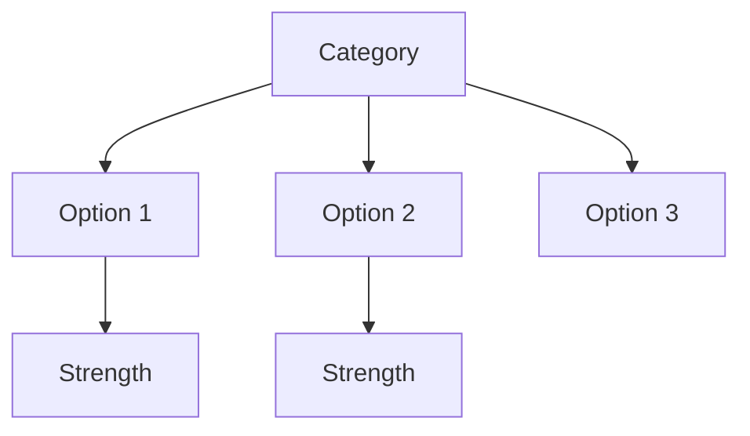
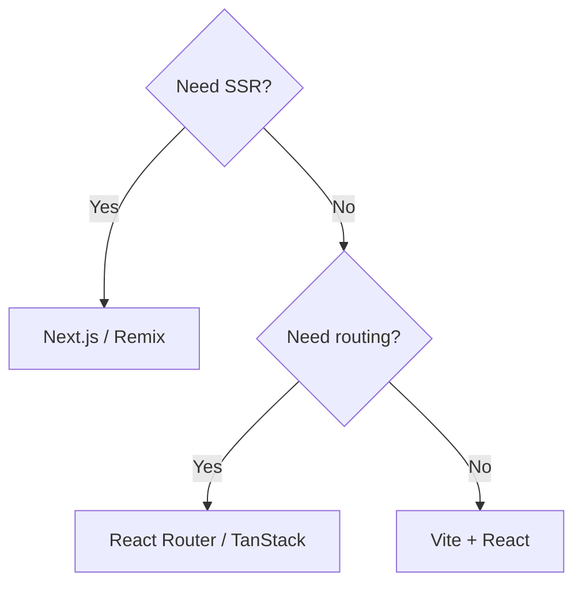
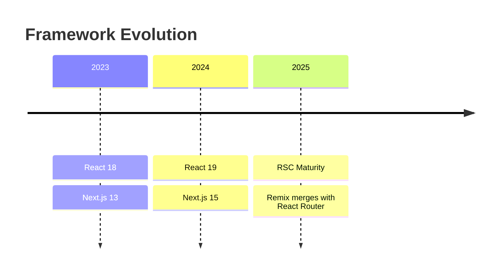

# Report Templates

Two templates for Deep Research output. Choose based on the research type.

## Template A: Comprehensive Research Brief

Use for landscape research, "state of X", or multi-faceted investigation.

```markdown
# [Topic] — Research Brief

> **Research conducted**: [Date] · **Sources analyzed**: [N] · **Rounds**: [N]

## Executive Summary

[2-3 paragraphs of narrative prose. This should read like a tech lead briefing
their team before a decision. Not bullet points — flowing analysis that
synthesizes the key takeaway, the current landscape, and the recommended
direction. A senior engineer should be able to read just this section and
understand the situation.]

## Landscape Overview

[Mermaid diagram showing the ecosystem, key players, relationships, or
architecture. This visual should orient the reader before diving into details.]

[Embedded screenshot(s) of key sites, tools, or UIs if applicable.]

## Key Findings

### Finding 1: [Descriptive Title]

**Source**: [Source Name](URL) (Tier: S/A/B)
**Axis**: [Which research axis this belongs to]

[Detailed analysis — what was learned, with specific numbers, code patterns,
or data points. Not a summary of the source, but the *insight* extracted
from it.]

[Embedded screenshot, code block, or table if the finding has visual or
code evidence.]

### Finding 2: [Descriptive Title]
...

[Continue for all significant findings, grouped by research axis.]

## Comparative Analysis

[If multiple options/approaches were studied, present a comparison table:]

| Dimension | Option A | Option B | Option C | Notes |
|-----------|----------|----------|----------|-------|
| [Axis 1]  | ...      | ...      | ...      | ...   |
| [Axis 2]  | ...      | ...      | ...      | ...   |

[Mermaid decision tree if the comparison has conditional logic:]

## Gaps & Open Questions

- **[Gap 1]**: [What couldn't be determined and why]
- **[Gap 2]**: [Conflicting information between Source A and Source B]
- **[Gap 3]**: [Area where only C/D-tier sources exist]

## Recommendations

1. **[Top recommendation]** — [Specific, actionable advice with rationale.
   Reference the findings that support this.]
2. **[Secondary recommendation]** — ...
3. **[If applicable: "Try X before committing to Y"]** — ...

## Sources

| # | Source | Tier | Used For |
|---|--------|------|----------|
| 1 | [Name](URL) | S | [Brief note on what was extracted] |
| 2 | [Name](URL) | A | ... |
| ... | | | |
```

---

## Template B: Framework / Tool Comparison

Use for head-to-head evaluations: "X vs Y", "which should we use", build vs buy.

```markdown
# [Option A] vs [Option B] — Comparison Brief

> **Research conducted**: [Date] · **Sources analyzed**: [N] · **Rounds**: [N]

## TL;DR

[1-2 sentence verdict. Be decisive — "Use X if [condition], use Y if
[other condition]." Hedging is acceptable only when genuinely warranted.]

## Decision Context

[What is the user deciding? What constraints and priorities apply?
This section grounds the comparison in the actual decision, not abstract
feature parity.]

- **Primary goal**: [e.g., "Reduce bundle size for mobile-first B2C app"]
- **Constraints**: [e.g., "Team has 2 senior React devs, no Vue experience"]
- **Timeline**: [e.g., "Must ship MVP in 8 weeks"]

## Head-to-Head

| Dimension | [Option A] | [Option B] | Edge |
|-----------|------------|------------|------|
| Performance | ... | ... | A/B/Tie |
| DX | ... | ... | A/B/Tie |
| Ecosystem | ... | ... | A/B/Tie |
| Bundle Size | ... | ... | A/B/Tie |
| Learning Curve | ... | ... | A/B/Tie |
| Community | ... | ... | A/B/Tie |

**Score**: [Option A] [N] — [Option B] [N]

## Deep Dives

### [Axis 1]: [e.g., Performance]

[Detailed analysis with evidence. Include:]
- Specific benchmark numbers with sources
- Code comparison showing API differences
- Screenshots of tooling/dashboards if visual

### [Axis 2]: [e.g., Developer Experience]
...

[One deep dive per major axis. Each should have at least one piece of
concrete evidence — code, screenshot, benchmark, quote from practitioner.]

## Migration Complexity

[If the user is considering switching FROM an existing tool:]

| Factor | Impact | Notes |
|--------|--------|-------|
| Codebase changes | High/Med/Low | ... |
| Team ramp-up | High/Med/Low | ... |
| Ecosystem compatibility | High/Med/Low | ... |
| Estimated effort | [time range] | ... |

## Recommendation

[Decisive recommendation with conditions. Structure as:]

**For your context** ([reference decision context above]):
→ **Use [Option X]** because [1-2 sentence rationale tied to their constraints].

**You would choose the other option if**: [condition that would flip the
recommendation].

## Sources

| # | Source | Tier | Used For |
|---|--------|------|----------|
| 1 | [Name](URL) | S | ... |
| ... | | | |
```

---

## Formatting Guidelines

These apply to both templates:

### Visual Richness Checklist
- [ ] At least **1 mermaid diagram** (ecosystem map, architecture, decision tree, or flow)
- [ ] At least **1 embedded screenshot** (from `browser_subagent` during research)
- [ ] At least **1 comparison table** with real extracted data
- [ ] At least **1 code example** if the topic involves APIs, frameworks, or tools
- [ ] Executive summary is **narrative prose**, not bullets

### Citation Style
- Inline citations: `[Source Name](URL)` immediately after the claim
- Source table at the end: numbered, with tier and usage note
- Every factual claim MUST have a citation. Opinions and analysis don't require citation but should be clearly marked as such.

### Mermaid Diagram Patterns

**Ecosystem map** (landscape research):


**Decision tree** (comparison research):


**Timeline** (evolution / trends):

