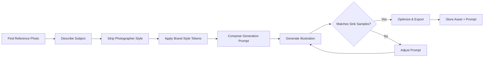

# Image Reinterpretation Reference

Transform found photography into brand-consistent illustrated assets. This prevents copyright issues while maintaining a cohesive visual identity.

---

## Why Reinterpret?

1. **Copyright** — Photos found online are copyrighted. Using them directly is infringement.
2. **Brand coherence** — A mix of photographic styles creates visual noise. A consistent illustration language unifies the brand.
3. **Reproducibility** — A defined pipeline + stored prompts mean any team member (or agent) can produce on-brand assets.

---

## Style Definition Template

Fill this out during Phase 0 discovery or Phase 3 (Voice & Tone). Store in the project's brand guide / `GEMINI.md`.

```yaml
illustration_style:
  rendering: "flat vector"          # flat vector | line art | watercolor | ink sketch | low-poly 3D | paper-cut
  palette: "brand palette only"     # brand palette only | monochrome + accent | analogous warm | full-spectrum muted
  detail_level: "moderate"          # minimal/iconic | moderate/editorial | high/realistic
  stroke: "thick outline"           # none | uniform weight | hand-drawn taper | thick outline
  texture: "subtle grain"           # clean/digital | grain/risograph | paper/organic
  mood:                             # 3–5 adjectives aligned with Voice
    - "confident"
    - "nostalgic"
    - "welcoming"
  avoid:                            # Negative prompts / things to exclude
    - "photorealistic elements"
    - "stock photo aesthetics"
    - "clip art"
```

---

## Reinterpretation Pipeline



### Step 1: Describe the Subject

Write a neutral description of the photo's content. Focus on:
- **Who/what** — The subject (person, object, scene)
- **Action/pose** — What's happening
- **Setting** — Environment, context
- **Mood** — Emotional tone of the scene

**Strip** anything specific to the original photograph: lighting style, camera angle emphasis, photographer's artistic choices, watermarks, competing brand elements.

### Step 2: Compose the Prompt

Combine the subject description with the project's illustration style tokens:

```
[Subject description from Step 1].
Rendered in [rendering] with [palette description using actual brand colors].
[Detail level] detail, [stroke] strokes, [texture] finish.
The mood is [mood keywords joined with commas].
No photographic elements. [Any items from 'avoid' list].
```

### Step 3: Generate

Use the `generate_image` tool (or equivalent AI image generation):

```
generate_image(
  prompt: composedPrompt,
  // Optionally pass the reference photo to guide composition (NOT to copy style):
  imagePaths: ["/path/to/reference-photo.jpg"]
)
```

> [!IMPORTANT]
> When passing a reference image, the prompt MUST override the photo's style. The reference is for composition/subject guidance only, not style transfer.

### Step 4: Validate

Compare the output against the kitchen sink's Illustration Gallery section. Check:

- [ ] Color palette matches brand tokens (not arbitrary AI colors)
- [ ] Rendering style is consistent (vector vs. sketch vs. watercolor)
- [ ] Detail level matches existing illustrations
- [ ] Stroke weight and style are consistent
- [ ] Texture/finish aligns with brand
- [ ] No photorealistic elements leaked through
- [ ] Mood aligns with brand voice

If 2+ checks fail, adjust the prompt and regenerate.

### Step 5: Optimize & Store

1. **Export format**: WebP for web (80% quality), PNG for transparency needs, SVG if the rendering style supports it
2. **Sizes**: Generate at 2× display size for retina, let `<Image>` or CSS handle responsive sizing
3. **Alt text**: Write descriptive alt text per the content design guidelines
4. **Store the prompt**: Save the generation prompt alongside the asset (in a comment, metadata file, or CMS field) for future reproduction

---

## Prompt Library

Build a project-specific prompt library as illustrations accumulate. Group by subject type:

### People / Characters
```
A [role/description] [action]. Rendered in [style]...
```

### Places / Environments
```
[Environment description] at [time of day]. Rendered in [style]...
```

### Objects / Products
```
[Object description] on a [surface/context]. Rendered in [style]...
```

### Abstract / Conceptual
```
An abstract representation of [concept]. Rendered in [style]...
```

---

## Sink Page Integration

The kitchen sink's Illustration Gallery section should include:

```tsx
{/* ── Illustration Gallery ── */}
<section id="illustrations" className="space-y-8">
  <h2 className="text-2xl font-semibold border-b pb-2">
    Illustration Gallery
  </h2>
  <p className="text-muted-foreground">
    Brand illustration style reference. All images produced via the
    reinterpretation pipeline — no unmodified photography.
  </p>

  {/* Style Definition Card */}
  <div className="rounded-xl border bg-muted/30 p-6">
    <h3 className="text-sm font-medium text-muted-foreground mb-3">
      Style Tokens
    </h3>
    <dl className="grid grid-cols-2 gap-x-6 gap-y-2 text-sm sm:grid-cols-3">
      <div><dt className="text-muted-foreground">Rendering</dt><dd>Flat vector</dd></div>
      <div><dt className="text-muted-foreground">Palette</dt><dd>Brand only</dd></div>
      <div><dt className="text-muted-foreground">Detail</dt><dd>Moderate</dd></div>
      <div><dt className="text-muted-foreground">Stroke</dt><dd>Thick outline</dd></div>
      <div><dt className="text-muted-foreground">Texture</dt><dd>Subtle grain</dd></div>
      <div><dt className="text-muted-foreground">Mood</dt><dd>Confident, welcoming</dd></div>
    </dl>
  </div>

  {/* Sample Illustrations */}
  <div className="grid grid-cols-1 gap-6 md:grid-cols-2 lg:grid-cols-3">
    {illustrations.map((illust) => (
      <figure key={illust.name} className="space-y-2">
        <div className="overflow-hidden rounded-lg border">
          
        </div>
        <figcaption className="text-xs text-muted-foreground">
          {illust.name}
        </figcaption>
      </figure>
    ))}
  </div>

  {/* Prompt Template */}
  <div className="rounded-xl border bg-muted/30 p-6">
    <h3 className="text-sm font-medium text-muted-foreground mb-3">
      Generation Prompt Template
    </h3>
    <pre className="whitespace-pre-wrap text-sm font-mono">
{`[Subject description]. Rendered in flat vector style with
[brand palette colors]. Moderate detail, thick outline strokes,
subtle grain texture. The mood is confident and welcoming.
No photographic elements.`}
    </pre>
  </div>
</section>
```

---

## Anti-patterns

| ❌ Don't | ✅ Do |
|---|---|
| Use stock photos directly | Reinterpret through the illustration pipeline |
| Let AI pick random colors | Constrain to brand palette in every prompt |
| Generate without a reference style | Always compare against sink gallery samples |
| Discard the generation prompt | Store prompts alongside assets for reproduction |
| Use different illustration styles per page | One style per brand; document exceptions explicitly |
| Skip alt text on illustrations | Every visual gets descriptive alt text |
